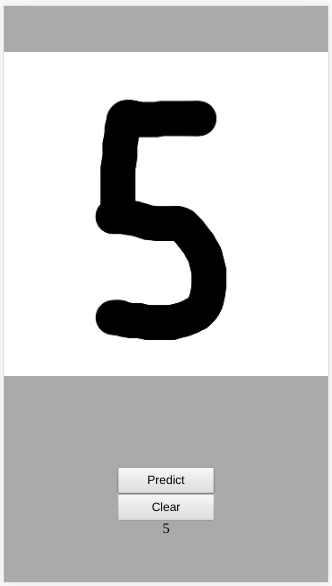

# Digit Recognition

Implementation of a digit recognition using my [neural network ](https://github.com/victorqribeiro/mlp) with [MNIST](http://lorenhoward.com/articles/mnist-handwritten-dataset-json/)

Live version [here](https://victorribeiro.com/digitRecognition)

## About

I made this experiment to test how long it would take to train my neural network with MNIST and how accurate it would be at the end. Turns out I have a long way to go.

## How to use it

Draw the digit on the white rectangle (try to use to whole area) and press predict for the neural network indentify the digit. Press clear to clear the white drawing area.
